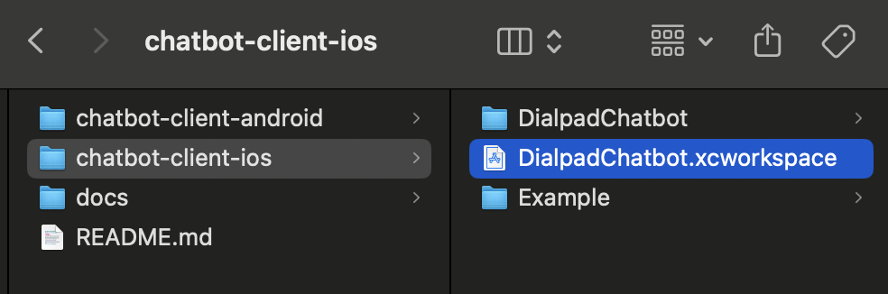
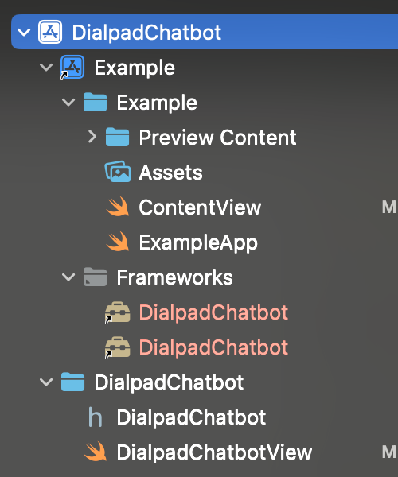
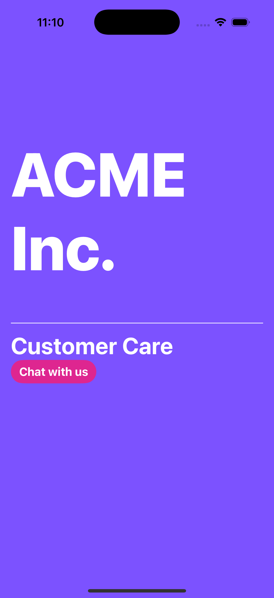
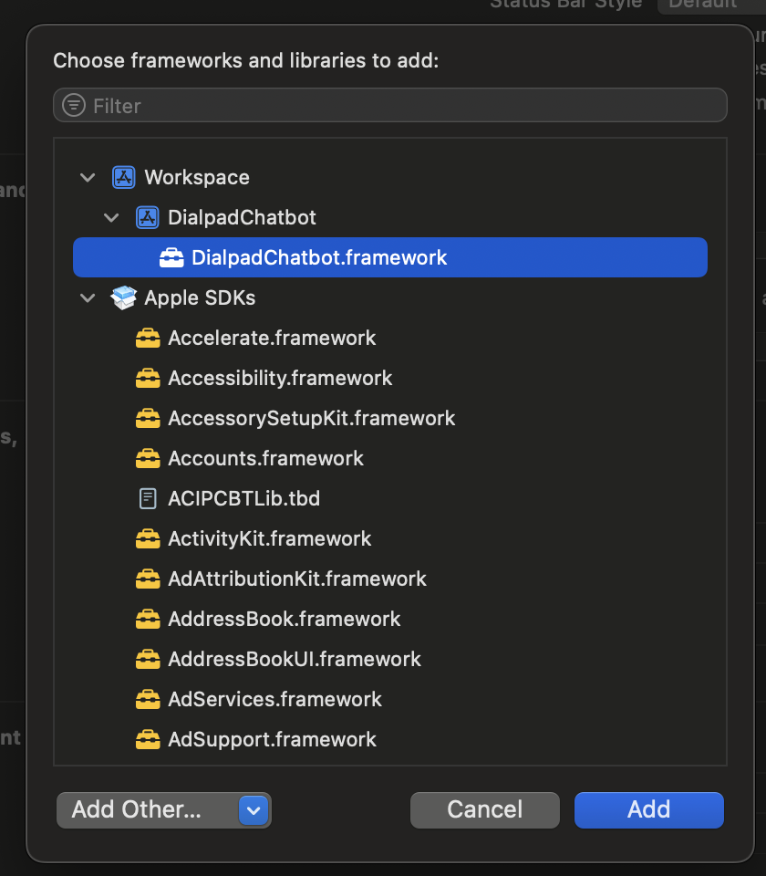
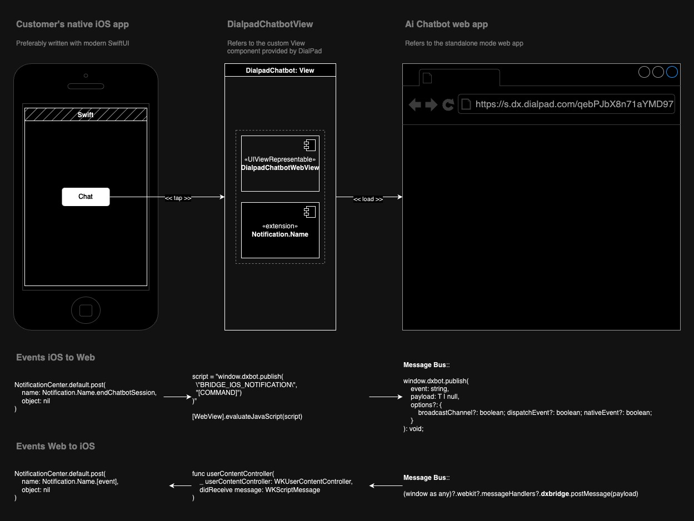

# Getting Started with Ai Chatbot

## Chatbot support for native mobile apps

### iOS

`chatbot-client` aka the `Ai Chatbot` is supported in the native iOS apps via [`WKWebView`](https://developer.apple.com/documentation/webkit/wkwebview). We also provide a `Swift` project, which can be downloaded from the [Dialpad help center](https://help.dialpad.com/), or cloned from our GitHub [repository](https://github.com/dialpad/dx-native-clients). The project comes with a vanilla Swift framework that can be embedded directly in the native iOS app.

#### Prerequisites for native iOS integration

- Working knowledge of `Swift`, `SwiftUI` and `iOS` development in `Xcode`.
- Basic knowledge of `GitHub` / `git`.
- Tested on `MacOS` v15.2 and `Xcode` v16.2.

#### Steps for integration with a native iOS app

##### #1

Go to the [Dialpad help center](https://help.dialpad.com/) or the GitHub repository named [dx-native-clients](https://github.com/dialpad/dx-native-clients). If you are having trouble accessing the GitHub repo, please reach out the professional services team member.

##### #2

Either download the project archive from the help center, or clone the `dx-native-clients` repository. If you've downloaded the project, unarchive it in your preferred local directory.

> **Quick Check**: the iOS project is located in a subdirectory named `chatbot-client-ios`. After unarchiving/cloning, your directory should look something like this -



##### #3

Locate the project's workspace file [`DialpadChatbot.xcworkspace`](./chatbot-client-ios/DialpadChatbot.xcworkspace) and open it in a Xcode

> **Quick Check**: after opening the workspace file in your Xcode, your directory should look something like this -



##### #4

(**Optional**) build and run the Example app in your local environment, or skip to step#5

- Select scheme `DialpadChatbot` in the Xcode.
- Run: ⌘ + ⇧ + K (command + shift + K) to clean the framework build.
- Run: ⌘ + B (command + B) to build the the framework.
- Select scheme `Example` in the Xcode.
- Locate the `Swift` file named [`ExampleApp.swift`](./chatbot-client-ios/Example/Example/ExampleApp.swift) and replace the `url` parameter with your chatbot's production URL. You can get long URL with `&native=ios` param from the Digital Experience admin pages.
- Run: ⌘ + ⇧ + K (command + shift + K) to clean the app build.
- Run: ⌘ + B (command + B) to build the the example app.
- Run: ⌘ + R (command + R) to run the selected scheme in your simulator, or the connected `iPhone` with `iOS` v16+.

> **Quick Check**: a successful build and run should look something like this -



##### #5

Locate the subdirectory named [`DialpadChatbot`](./chatbot-client-ios/DialpadChatbot) in the Finder. This subdirectory contains the `Swift` framework for the chatbot

##### #6

Drag-and-drop the `DialpadChatbot` directory from step#5 into your main iOS project workspace

##### #7

Select the top-level main app in Xcode and go the section containing the `Frameworks, Libraries, and Embedded Contents` in `Targets` > Your app > `General`. Click `+` and use the Xcode modal to add `DialpadChatbot` as a framework.

> **Quick Check**: clicking the `+` should bring up a modal that looks something like this -



##### #8

At this point you can modify your application code to launch and manage the `Ai Chatbot`. We recommend you to take a look at the starter code in the file named [`ContentView.swift`](./chatbot-client-ios/Example/Example/ContentView.swift). Here are three key points -

In LN102: the `DialpadChatbotView` is getting initialized by passing an URL.

```swift
if viewModel.isOpen {
    VStack(..., content: {
        Button(action: {
            ...
        })
        ...
        DialpadChatbotView(url: url)
    })
}
```

In LN90: the `Button` action is triggering a `NotificationCenter` event to end the chat session.

```swift
NotificationCenter.default.post(name: Notification.Name.endChatbotSession, object: nil)
```

In LN18: the `ContentView` struct is adding a publisher for a `NotificationCenter` event. This event notifies that the chat session has ended.

```swift
let chatbotSessionEnded = NotificationCenter.default.publisher(for: NSNotification.Name.chatbotSessionEnded)
...
```

##### #9

Build the `DialpadChatbot` framework, and then build and run your main app. You may follow the instructions from step#4.

<hr />

#### (**Optional**) Basic overview of the iOS native app ⇆ Chatbot web app communication



#### Supported features in iOS

&#9745; Launching chatbot in a `WKWebView`. <br />
&#9745; Chatbot experience in portrait mode. <br />
&#9745; Sending selected events from the chatbot to the containing app. <br />

- Chatbot session started <br />

```swift
NotificationCenter.default.publisher(for: NSNotification.Name.chatbotSessionStarted)
```

- Chatbot session ended <br />

```swift
NotificationCenter.default.publisher(for: NSNotification.Name.chatbotSessionEnded)
```

&#9745; Sending selected events from the the containing app to the chatbot. <br />

- End chatbot session <br />

```swift
NotificationCenter.default.post(
    name: Notification.Name.endChatbotSession,
    object: nil
)
```

#### Known Issues and Unsupported features

&#9744; Chatbot experience in landscope mode. <br />
&#9744; Network interruptions. <br />
&#9744; Handling app sent to background. <br />
&#9744; Handling app brought from the background. <br />

<hr />

### Android

#### Prerequisites for native Android integration

- Working knowledge of `Kotlin` and `Android` development in `Android Studio`.
- Basic knowledge of `GitHub` / `git`.

#### Steps for integration with a native Android app

&#9744; TODO

#### Supported features in Android

&#9744; TODO. <br />

#### Known Issues and Unsupported features in Android

&#9744; TODO. <br />
